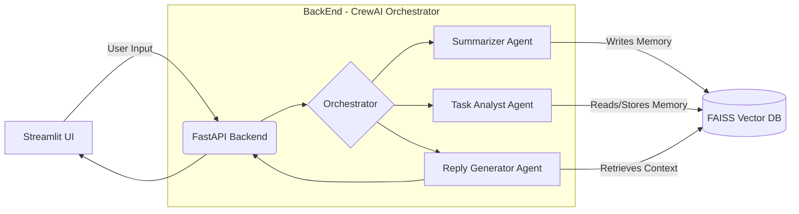

# 🤖 Agentic AI Workflow Automation System  
**_Autonomous Multi-Agent Email Intelligence Platform • CrewAI + Gemini + FastAPI + Streamlit_**


> **A Production-Ready Multi-Agent System that reads emails, extracts tasks, generates smart replies, and remembers long-term context using Vector Memory (FAISS).**  
> Built as a **flagship Generative AI project** for real-world enterprise automation use cases.

---

# 📌 Overview

Modern teams deal with **email overload**, context switching, and tasks hidden inside messages.  
This project solves that using a fully autonomous **Agentic AI Workflow System** that:

### ✅ Reads & understands raw emails  
### ✅ Summarizes long threads  
### ✅ Extracts structured tasks (JSON)  
### ✅ Generates professional replies  
### ✅ Stores memory (via embeddings) for future recall  

Unlike a simple chatbot, this system uses **true agentic reasoning**, where each agent has:

- 🧠 Its own **role**
- 🎯 Its own **goal**
- 🔧 Its own **toolset**
- 🔄 A shared memory (vector DB)
- 🗂️ A central orchestrator via **CrewAI**

It is built with a **backend-first architecture (FastAPI)** and a clean **Streamlit UI**, making it perfect for production, demos, and portfolio showcase.

---

# 🏗️ Architecture

### **High-Level System Architecture**



### **Why This Architecture Passes Recruiter Bar?**
Because it shows mastery in:

✔️ Multi-agent orchestration  
✔️ Tool-calling reasoning  
✔️ Memory-augmented LLM workflows  
✔️ API-first architecture + UI separation  
✔️ RAG + Agents + MLOps alignment  

This is the exact structure used in modern **AI automation companies**.

---

# 🚀 Key Features

### 🧠 1. **Autonomous Multi-Agent Team (CrewAI)**  
- **Summarizer Agent:** Understands long email threads.  
- **Task Agent:** Extracts to-do items in JSON with deadlines.  
- **Reply Agent:** Generates professional, contextual email responses.  

### 🗂️ 2. **Vector Memory (FAISS)**  
Stores semantic memory for:  
- Project codes  
- Confidential context  
- Past conversation snippets  
- Long-term knowledge  

Memory is queried automatically.

### 🔌 3. **API-Driven Backend (FastAPI)**  
Modern, async, production-ready backend with:  
- Validation (Pydantic)  
- CORS support  
- Clean routing structure  

### 💻 4. **Streamlit Frontend**  
- One-click execution  
- Memory search panel  
- Auto-scroll logs  
- Copy-to-clipboard replies  

### 🐳 5. **Dockerized for Deployment**  
You can deploy it on:  
- Render  
- Railway  
- AWS EC2  
- Azure Container Apps  

---

# 🛠️ Tech Stack

| Layer | Technology | Description |
|-------|------------|-------------|
| **LLM & Reasoning** | CrewAI, Google Gemini 1.5 Flash | Agent roles, task delegation, reasoning loops |
| **Vector Store** | FAISS | In-memory & disk-based similarity search |
| **Backend** | FastAPI | High-performance REST API |
| **Frontend** | Streamlit | Lightweight reactive UI |
| **Embeddings** | Sentence Transformers | Memory encoding |
| **Deployment** | Docker | Reproducible environment |

---

# ⚙️ Installation

### 1. Clone the Repository

```bash
git clone https://github.com/yashdesai023/agentic-workflow.git
cd agentic-workflow
```

### 2. Create `.env`

```env
GOOGLE_API_KEY=YOUR_API_KEY
```

### 3. Install Dependencies

```bash
python -m venv venv
source venv/bin/activate       # Mac/Linux
venv\Scripts\activate          # Windows

pip install -r requirements.txt
```

---

# ▶️ Run the Application

### **Terminal 1 — Backend (FastAPI)**

```bash
uvicorn src.api.main:app --reload
```

API Docs → http://127.0.0.1:8000/docs

### **Terminal 2 — Frontend (Streamlit)**

```bash
streamlit run src/ui/ui_app.py
```

UI → http://localhost:8501

---

# 🧪 Testing Scenarios (For Recruiters & Hiring Managers)

### **Scenario 1 — Full Workflow Intelligence**

Input email:
> “Fix login bug, update policy by Friday, and schedule a design meeting for Tuesday.”

What the system will produce:  
1. **Summary** (clean, actionable)  
2. **Task Breakdown** (JSON with deadlines)  
3. **Reply Draft** (professional confirmation)

---

### **Scenario 2 — Memory Recall (RAG)**  
Teach the system:
> “Project codename for the AI initiative is OMEGA-RED.”

Then search memory:
- Query: “What is the project code?”  
**Expected:** Retrieve “OMEGA-RED” with exact context.

---

# 🐳 Docker Usage

```bash
docker build -t agentic-workflow .
docker run -p 8080:8080 agentic-workflow
```

---

# 📂 Project Structure

```text
Agentic_AI_Workflow/
│
├── src/
│   ├── agents/             # All intelligent agents
│   ├── api/                # FastAPI routes
│   ├── pipeline/           # CrewAI Orchestration
│   ├── tools/              # Vector DB & utilities
│   ├── ui/                 # Streamlit Frontend
│   └── main.py             # CLI entry point
│
├── data/                   # Sample email data
├── Dockerfile
├── requirements.txt
└── README.md
```

---

# 📬 Contact & Portfolio

**Yash Desai — Generative AI & LLM Engineer**

- **GitHub:** https://github.com/yashdesai023  
- **LinkedIn:** https://www.linkedin.com/in/yash-s-desai  
- **Email:** desaisyash1000@gmail.com  

---

_Developed with ❤️ using CrewAI + FastAPI + Gemini 1.5 Flash._

